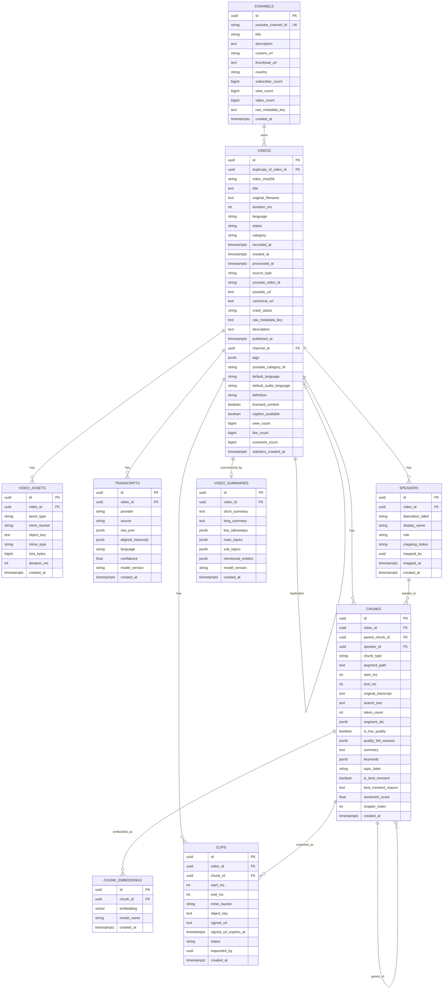

# Database Diagram

Mermaid ER diagram for the current SQLAlchemy/Alembic schema.



## Main Flow

```text
channels
  -> videos
      -> video_assets
      -> transcripts
      -> speakers
      -> chunks
          -> chunk_embeddings
          -> clips
      -> video_summaries
```

## Chunk Hierarchy

```text
topic_segment chunk
  -> semantic chunk
      -> atomic chunk
```

Search currently retrieves embedded semantic chunks, while atomic chunks are mainly used for chunk construction, speaker assignment, and quality checks.
